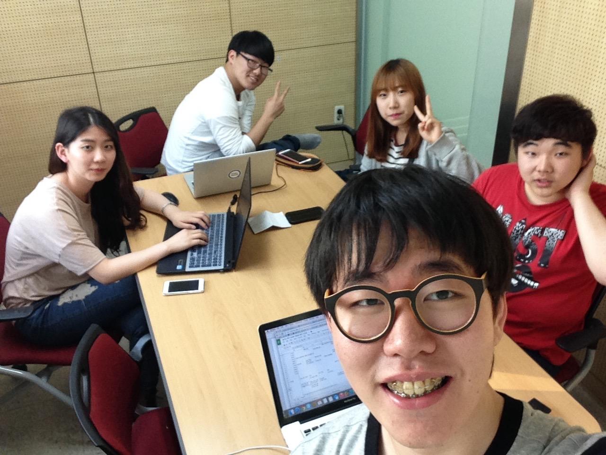
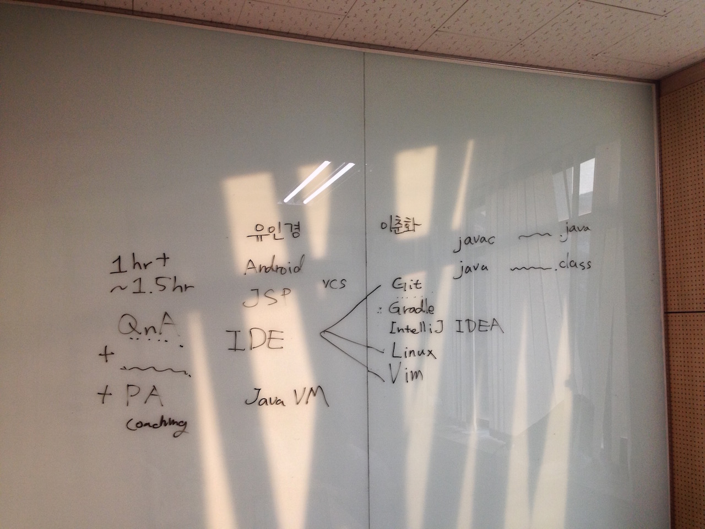

## 멘토링 정보

- 멘토링 교과목명: 객체지향설계및프로그래밍
- 오프라인 멘토링

    * 장소: 산학기술관 519호
    * 날짜: 2015년 4월 30일
    * 주당 멘토링 시간: 1시간

- 온라인 멘토링

    * 주소: https://github.com/kyukyukyu/oop-mentoring
    * 날짜: 2015년 4월 30일 ~
    * 주당 멘토링 시간: 상시진행

## 멘토링 진행 결과

- 오프라인: 멘티 현황 파악하기, 오프라인 멘토링 진행방향 정하기
- 온라인:
- 참석자: 멘토링 팀 전원 오프라인 멘토링 참여.

## 멘토링 내용

이번 모임은 저희 멘토링 팀이 오프라인으로 처음 모인 자리였습니다. 중간고사 기간
직후에 가진 첫 모임이었기 때문에 교과목 질의응답 및 학습 지도보다는 저희 팀이
앞으로 멘토링 프로그램을 어떻게 진행할지 같이 고민하는 것에 초점을 맞추어 모임을
진행했습니다.

우선, 멘티 친구들이 본 과목을 어떻게 학습하고 있는지 파악하는 시간을 가졌습니다.
멘티 친구들이 각자 프로그래밍을 얼마나 해 보았고, 어떤 프로그래밍 언어를 사용해
보았으며, 객체지향설계및프로그래밍 (이하 OOP) 교과목을 학습하면서 어떤 어려움을
겪었고, 이번 멘토링 프로그램에 참여하면서 무엇을 배우고 싶은지를 말해
보았습니다. 김도민 학생은 대학생이 되면서 프로그래밍을 처음 접했고, 지금까지는
C, C++, Python, Java 프로그래밍 언어를 다뤄보았으며, 이번 학기에 수강하고 있는
강의가 어렵게 느껴진다고 말했습니다. 권나현 학생도 비슷한 프로그래밍 경험을
가지고 있으며, 객체지향 패러다임 개념에 대해 좀 더 체계적으로 학습하고 싶다고
말했습니다. 서창범 학생은 C 언어로만 프로그래밍을 하다가 이번에 OOP 강의를
들으면서 처음으로 Java를 사용한 OOP를 해 보게 됐으며, OOP를 통해 무엇을 할 수
있는지 배우고 싶다고 말했습니다. 서아정 학생도 비슷한 의견을 보였습니다.

멘티 친구들의 이야기를 듣고 나서, 교과목 수강과 관련해서는 획일화된 멘토링을
진행하기 어렵겠다고 생각했습니다. 각 반에서 다루는 내용과 멘티 개개인의 상황이
달랐기 때문입니다. 그래서 앞으로 진행될 오프라인 멘토링 모임들은 멘티 친구들에게
교과목과 관련된 질문을 받아 답변하는 시간과 함께 시작하기로 결정했습니다.
질의응답 이후에는 멘토인 제가 멘티 친구들의 프로그래밍 과제 수행을 지도하는
시간을 가지기로 했습니다.

이것만으로는 오프라인 멘토링 모임이 부실해질 수 있다고 판단하여 교과목과 직접
관련되진 않더라도 프로그래밍 및 전공 관련 활동에 도움이 될 만한 내용을
가르쳐주면 좋겠다고 생각했습니다. 제가 멘티 친구들에게 가르쳐줄 수 있는 것에는
무엇이 있는지 아래와 같이 생각해 보았습니다.

- 버전 관리 도구 Git 사용법
- 빌드 관리 도구 Gradle 사용법
- Java IDE IntelliJ IDEA 사용법
- \*nix(Unix/Linux/…) shell 사용법
- 텍스트 편집기 Vim 사용법

멘티 친구들은 앞으로의 전공 학습에 도움이 될 만한 것을 익히고 싶어했습니다.
친구들의 바람을 고려하여, 우선 \*nix shell 사용법, 텍스트 편집기 Vim 사용법, 버
전 관리 도구 Git 사용법을 가르치기로 정했습니다.

또한, 온라인 멘토링을 위한 공간으로 사용하기 위한 GitHub 저장소를 개설했습니다.
URL은 https://github.com/kyukyukyu/oop-mentoring/ 입니다. 이 저장소에 딸린 이슈
트래커를 사용하여 OOP 교과목과 관련하여 궁금한 점이 있는 사람이면 누구나 질문을
게시하고, 그에 대한 저의 답변을 받을 수 있도록 준비했습니다. 5월 1일 현재 이슈
트래커에 아직 게시된 질문이 없습니다.

## 멘토링 증빙

