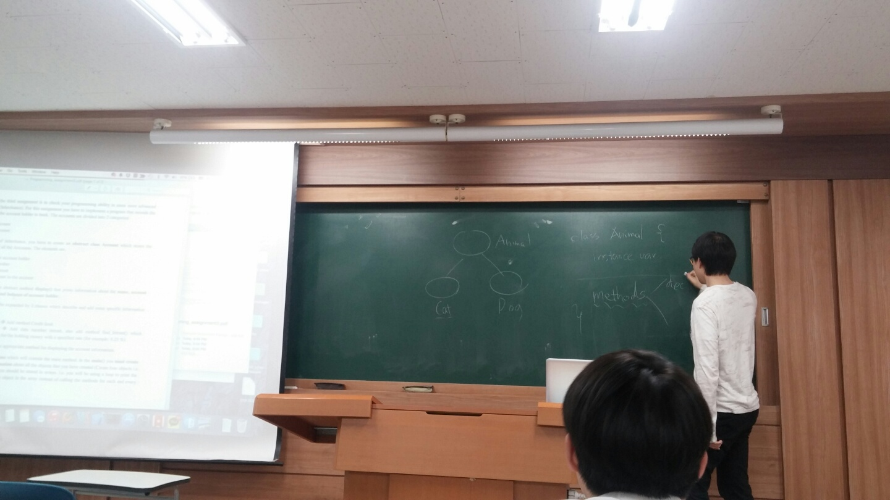
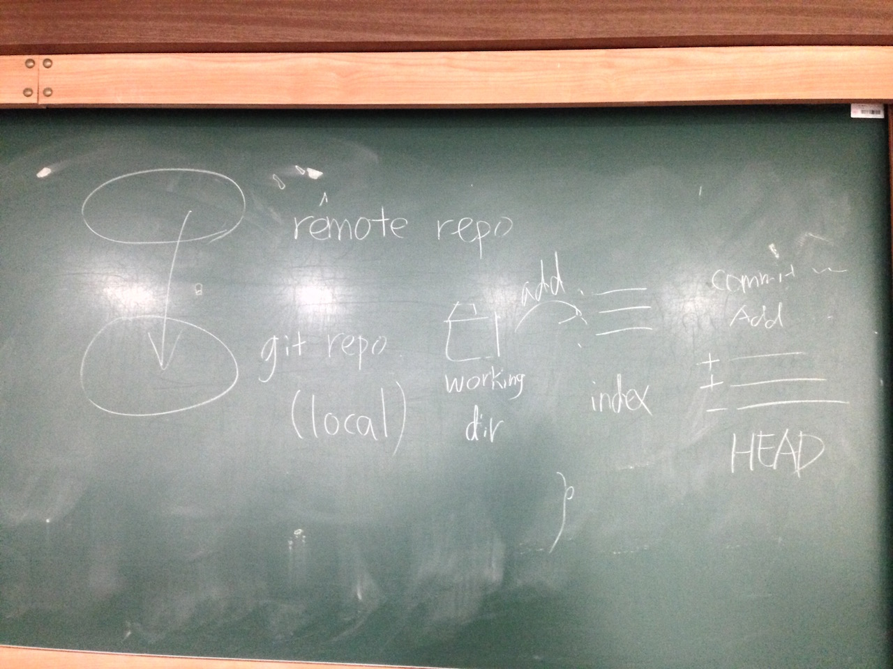

## 멘토링 정보

- 멘토링 교과목명: 객체지향설계및프로그래밍
- 오프라인 멘토링

    * 장소: IT/BT관 201호
    * 날짜: 2015년 5월 8일
    * 주당 멘토링 시간: 2시간

- 온라인 멘토링

    * 주소: https://github.com/kyukyukyu/oop-mentoring
    * 날짜: 2015년 4월 30일 ~
    * 주당 멘토링 시간: 상시진행

## 멘토링 진행 결과

- 오프라인: 추상 클래스, 접근 한정자, 오버라이딩에 관한 설명과 버전 관리 시스템
            Git 기초 사용법 교육
- 온라인:
- 참석자: 권나현, 서창범 학생 (김도민 학생은 개인 사정에 의해 불참. 서아정
          학생은 정규 수업으로 인해 불참.)

## 멘토링 내용

이번 오프라인 멘토링 모임에선 처음으로 QnA 세션을 가졌습니다. 교수님께서 내주신
과제의 요구사항에 대해 살펴보다가 추상 클래스에 대한 질문을 받아 이에 대해
설명하였습니다. 추상 클래스는, 정의를 포함하지 않고 선언만 존재하는 추상
메서드를 가진 클래스라고 설명하고, 학생들의 교과목에서 다루는 프로그래밍 언어인
Java에서 이를 어떻게 정의하는지를 알려주기 위해 예시 코드를 작성해서
보여주었습니다.

예시 코드를 작성하면서 인스턴스 변수의 접근 한정자(access modifier)를 변경할
일이 생겼는데, 이것과 관련해서도 멘티 친구들이 질문을 했습니다. 이와 관련해서는
각 접근 한정자의 제한 정도를 설명하고, 간단한 예시 코드를 작성하여 어떤 접근
한정자를 사용하느냐에 따라 코드가 유효할 수도 있고, 아닐 수도 있음을
보였습니다.

곧이어 멘티 친구들이 추상 클래스와 오버라이딩이 서로 연관된 것 아니냐는 질문과,
오버라이딩과 오버로딩이 헷갈린다는 의견을 제시했습니다. 추상 클래스 안에
존재하는 추상 메서드를 하위 클래스에서 구현하는 것과 메서드 오버라이딩은
비슷하긴 하지만 다른 것이라고 설명했습니다. 오버로딩은 이름이 같으나 매개변수의
개수와 타입이 다른 메서드들을 여러 개 구현하는 것이고, 오버라이딩은 상위
클래스에서 정의된 메서드의 구현을 하위 클래스에서 변경하는 행위라고
설명했습니다.

QnA 세션 다음에 진행된 트레이닝 세션에서는 Git 기초 사용법에 대해
살펴보았습니다. 먼저, Git과 같은 버전 관리 시스템이 하는 일이 무엇이고 이를
사용하면 무엇이 가능한지 설명했습니다. 버전 관리 시스템은 프로젝트의 작업
내역을 기록하고, 관리하며, 이를 사용하면 프로젝트의 각 버전 별 스냅샷을 일일이
만들 필요가 없고, 작업 내역을 분기하여 동시에 프로젝트의 서로 다른 부분을
작업한 다음 나중에 합치는 것이 용이하며, 작업 내역을 서버에 보관하여 다른
사람들과 쉽게 공유할 있다고 설명했습니다.

Git 기초 사용법을 설명할 때에는 Roger Dudler가 작성한 &lt;Git Guide&gt;를
박준태님과 Ardie Hwang님께서 번역하신
[&lt;Git - 간편 안내서&gt;](http://rogerdudler.github.io/git-guide/index.ko.html)
를 참조하였습니다. 위에서부터 살펴 보면서 기초 사용법을 알려줬습니다. 설명이
부족한 부분은 판서를 통해 보충하고, Git의 동작을 살펴보기 위해 이 문서에
소개되지 않은 `git status`, `git log`와 같은 명령을 추가로 설명했습니다. 또한,
로컬 저장소의 작업 내역을 원격 저장소에 올리고, 원격 저장소에 있는 작업 내역을
로컬 저장소로 받아오는 것을 직접 해 보기 위해 멘티 친구들에게 GitHub 계정을
만들고 저장소를 하나씩 만들어 보도록 지도했습니다. 시간 관계상 이번 모임에서는
'가지(branch) 치기'까지 다뤄보았습니다.

## 멘토링 증빙

