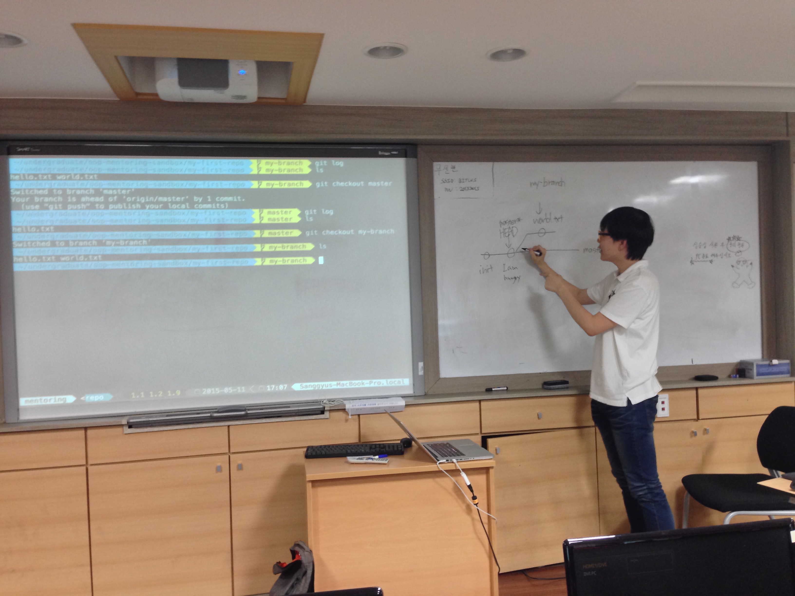

## 멘토링 정보

- 멘토링 교과목명: 객체지향설계및프로그래밍
- 오프라인 멘토링

    * 장소: IT/BT관 201호
    * 날짜: 2015년 5월 11일
    * 주당 멘토링 시간: 2시간

- 온라인 멘토링

    * 주소: https://github.com/kyukyukyu/oop-mentoring
    * 날짜: 2015년 4월 30일 ~
    * 주당 멘토링 시간: 상시진행

## 멘토링 진행 결과

- 오프라인: 버전 관리 시스템 Git 기초 사용법 교육
- 온라인:
- 참석자: 권나현, 김도민 학생 (서아정 학생은 병원 방문으로 인해 불참. 서창범
          학생은 정규 수업으로 인해 불참.)

## 멘토링 내용

이번 오프라인 멘토링 모임에선 트레이닝 세션만 진행되었습니다. 트레이닝
세션에서는 지난 시간과 마찬가지로 Git 기초 사용법에 대해 살펴보았습니다. 지난
시간에 배운 내용을 간단히 다시 보고, Git의 브랜치를 사용하는 방법에 대해 알아
보았습니다. 멘토인 저 뿐만이 아니라 멘티 친구들도 각자의 PC를 사용하여 실습에
참여하였습니다. 이번 시간에는 단순히 브랜치를 여러 개 만들어 동시에 여러 개의
작업 흐름을 만드는 것뿐만 아니라, 각 브랜치에서 작업한 내용을 `merge` 명령으로
합치는 것까지 다뤄 보았습니다.

이 명령을 사용하면 현재 브랜치와 다른 브랜치의 작업 내용을 합칠 수 있으며, 두
브랜치의 작업 내용이 합쳐졌음을 나타내는 머지 커밋이 생깁니다. 이 명령을
사용하여 작업 내용을 합칠 때 충돌이 발생할 수도, 발생하지 않을 수도 있는데, 두
가지 상황을 모두 만들어 보아 충돌이 발생했을 때에는, 즉 두 브랜치에서 같은
파일의 같은 위치에 변경을 가했을 때에는 Git이 자동으로 두 브랜치에서의 변경
사항 모두를 파일에 기록하여 사용자가 충돌을 직접 해결할 수 있게 한다는 것을
확인했습니다. 어느 브랜치의 가장 마지막 커밋을 가리키는 커밋을 `HEAD`
커밋이라고 하는데, 현재 브랜치의 `HEAD` 커밋을 `merge` 명령의 대상인 브랜치의
`HEAD` 커밋으로 이동하여 작업 내용을 합칠 수 있는 경우에는 머지 커밋을 따로
만들지 않으며, 이를 패스트 포워딩(fast forwarding)이라 한다는 것을
설명했습니다.

다음 시간에는 일본의 소프트웨어 기업인 Nulab에서 제작한
[누구나 쉽게 이해할 수 있는 Git 입문](http://backlogtool.com/git-guide/kr/)의
'발전편' 챕터를 참조하여 더 많은 사용법에 대해 알아 볼 예정입니다.

## 멘토링 증빙

