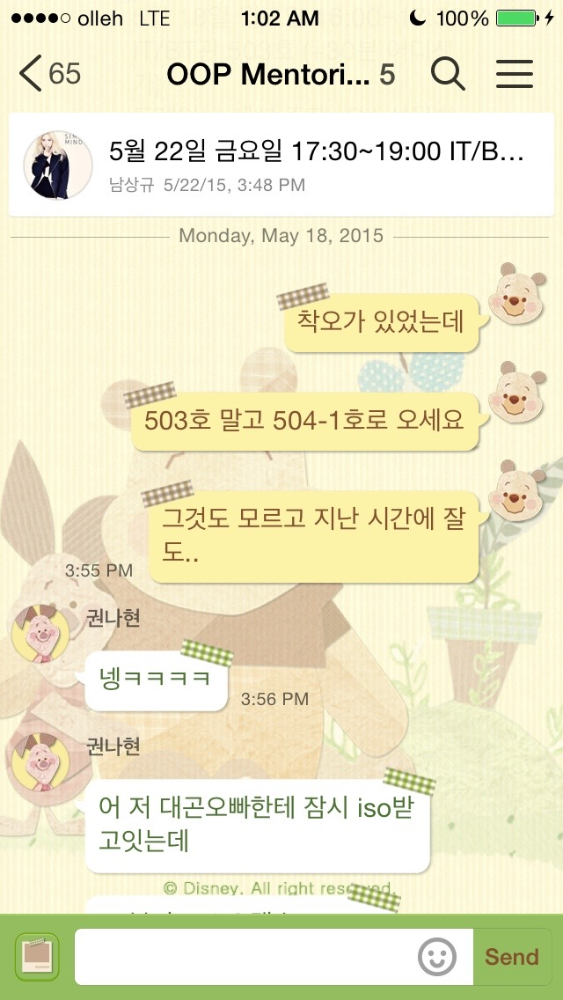
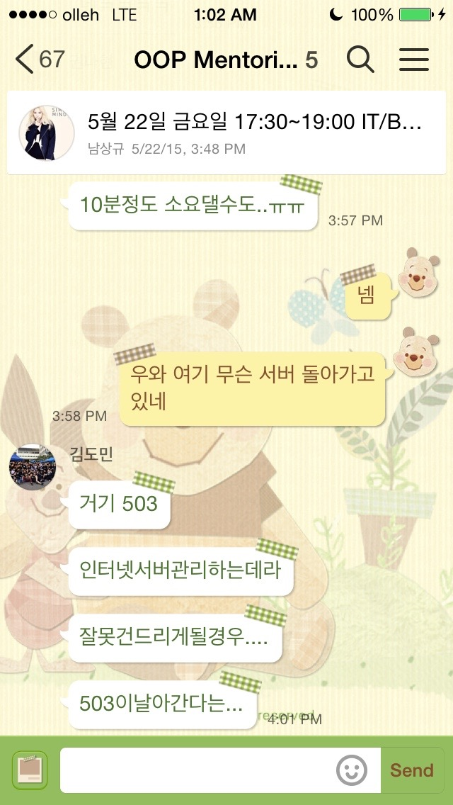
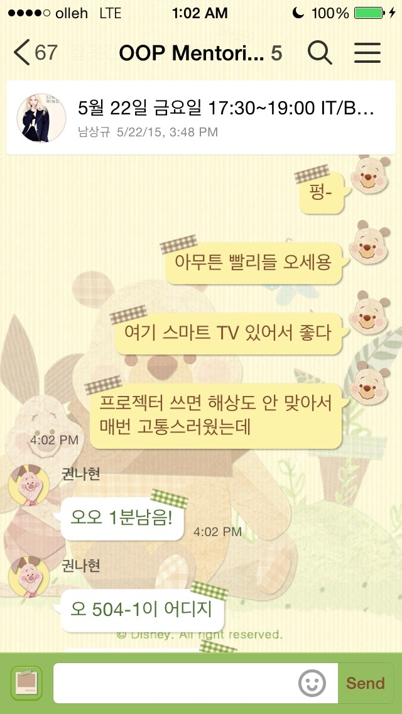
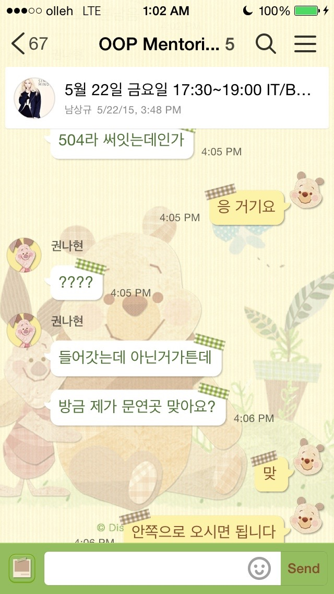
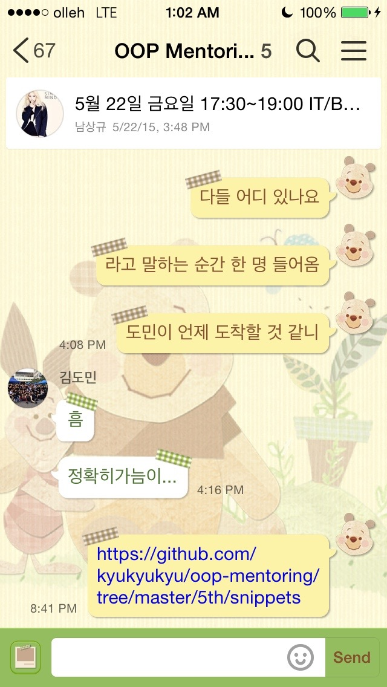
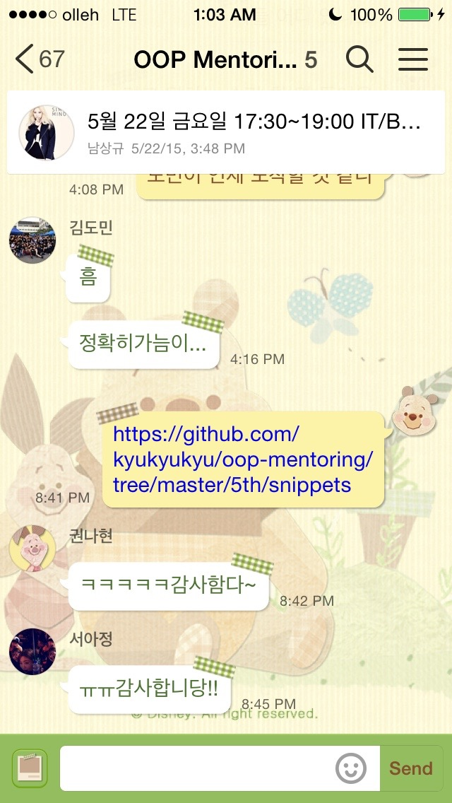

## 멘토링 정보

- 멘토링 교과목명: 객체지향설계및프로그래밍
- 오프라인 멘토링

    * 장소: IT/BT관 504-1호
    * 날짜: 2015년 5월 18일
    * 주당 멘토링 시간: 2시간

- 온라인 멘토링

    * 주소: https://github.com/kyukyukyu/oop-mentoring
    * 날짜: 2015년 4월 30일 ~
    * 주당 멘토링 시간: 상시진행

## 멘토링 진행 결과

- 오프라인: 추상 클래스 및 상속 관련 프로그래밍 과제 코칭
- 온라인:
- 참석자: 권나현, 서아정 학생 (김도민 학생은 개인 사정으로 인해 불참. 서창범
          학생은 정규 수업으로 인해 불참.)

## 멘토링 내용

이번 오프라인 멘토링 모임에선 프로그래밍 코칭 세션만 진행되었습니다. 오프라인
멘토링 모임에 참여한 학생들의 요청에 따라 프로그래밍 과제의 요구사항을
파악하고, 과제 수행 방향을 모색해 보는 시간을 가졌습니다.

오프라인 멘토링에 참여한 두 학생에게 주어진 프로그래밍 과제는 다음과
같았습니다. 두 종류의 계좌를 제공하는 은행에서 계좌를 만들고, 계좌의 정보를
표시하고, 각 계좌와 관련하여 특정한 작업을 수행하는 프로그램을 작성해야
했습니다. 단, '계좌'를 나타내는 추상 클래스를 정의하되, 계좌의 종류에 관계없이
공통으로 수행할 수 있는 작업은 추상 클래스에 정의되고, 이를 상속받는 두 종류의
자식 클래스를 정의하여 각 계좌 종류에서만 가능한 작업을 정의했어야 했습니다.

멘티 친구들이 이 교과목에서 다루는 프로그래밍 언어인 Java에서 추상 클래스를
정의하는 방법을 헷갈려해서 직접 개략적인 코드를 작성해 보며 지도했습니다.
계좌 객체가 어느 종류의 계좌인지를 나타내는 멤버 변수를 선언하기 위해 열거형
(enum) 자료형을 사용하는 것이 좋겠다고 지도하며, 열거형을 정의하는 방법을 같이
살펴 보았습니다. 제가 OOP 과목을 수강하면서 Java로 프로그래밍을 많이 할 때에는
열거형을 사용할 일이 많이 없어서인지 저조차도 열거형을 정의하는 방법을
헷갈려했습니다.

프로그래밍 과목의 프로그래밍 과제에서, 콘솔에 메뉴를 출력하고 사용자로부터
선택지를 입력받아 해당 메뉴의 기능을 수행하는 패턴이 자주 등장합니다.
프로그래밍을 처음 배울 때에는 `main()` 함수에 선택지를 입력받는 코드와 각
메뉴의 기능을 구현하는 코드를 작성하여 코드를 지나치게 복잡하게 만들곤 하는데,
이를 막기 위해 선택지를 입력받는 부분과 각 메뉴의 기능을 별개의 함수로 구현하는
방식을 소개하였습니다.

멘티 친구들이 지도를 요청한 프로그래밍 과제를 살펴 보면서 작성한 코드 조각들은
온라인 멘토링 공간에서 확인할 수 있습니다.

## 멘토링 증빙

오프라인 멘토링 모임에서 촬영한 사진이 없어 모임 당일 모바일 메신저 대화
내용으로 대체합니다.

