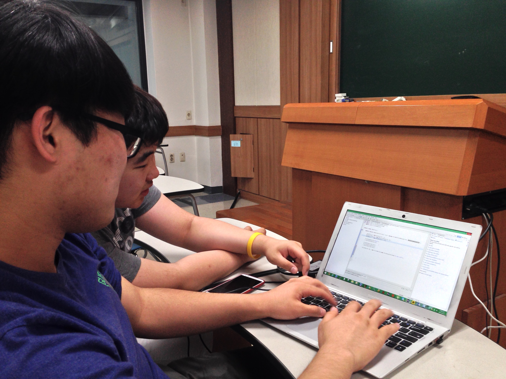
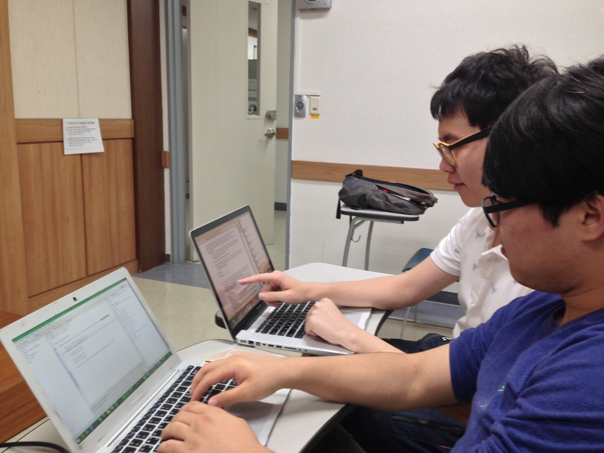

## 멘토링 정보

- 멘토링 교과목명: 객체지향설계및프로그래밍
- 오프라인 멘토링

    * 장소: IT/BT관 201호
    * 날짜: 2015년 5월 29일
    * 주당 멘토링 시간: 2시간

- 온라인 멘토링

    * 주소: https://github.com/kyukyukyu/oop-mentoring
    * 날짜: 2015년 4월 30일 ~
    * 주당 멘토링 시간: 상시진행

## 멘토링 진행 결과

- 오프라인: 퀴즈 관련 질문과 답변, 프로그래밍 과제 수행 코칭
- 온라인: Property와 method의 차이 설명
- 참석자: 김도민, 서창범 학생 (권나현 학생은 개인 사정으로 인해 불참, 서아정
          학생은 정규 수업으로 인해 불참.)

## 멘토링 내용

이번 오프라인 멘토링 모임에선 멘티 친구들이 치른 퀴즈에서 답하지 못 한 문제에
대해 이야기하고 새로 주어진 프로그래밍 과제를 어떻게 진행하면 좋을지에 대해
고민하는 시간을 가졌습니다.

### `PrintWriter`, `FileOutputStream`을 사용한 파일 출력

멘티 친구들 중 한 명이 Java 코드에서 데이터를 파일에 출력하는 문제를 해결하지
못 했다고 이야기했습니다. 파일 출력에 사용되는 빌트인 클래스의 이름과 사용법을
기억하지 못 해서 문제를 해결하지 못 했다고 했습니다. 그래서 Java 레퍼런스
문서를 참조하여 멘티 친구들이 수업 시간에 다뤘던 `PrintWriter` 클래스와
`FileOutputStream` 클래스에 대해 짚고 넘어갔습니다.

### 네 번째 프로그래밍 과제 코칭

멘티 친구들에게 주어진 네 번째 프로그래밍 과제는 다섯 번째 및 여섯 번째
오프라인 모임에서 다뤘던 프로그래밍 과제의 확장판으로, 계좌 입출금 기능과 계좌
및 거래 내역 데이터를 파일에 기록하여 읽고 쓰는 기능을 추가하는 것이었습니다.
나중에 배운 인터페이스, 예외 등의 언어 구성 요소를 사용해야 한다는 제약 사항이
존재했습니다. 지난 프로그래밍 과제와 마찬가지로 요구 사항에 모호한 부분이 있어
요구사항 전체를 제대로 파악하는 데에 어려움이 있었습니다. 예를 들면, 아래와
같은 제약 사항은 그 의도를 정확히 파악하기 힘들었습니다.

    > C. Both type of account should implements interfaces which define the
    > specified type of account as constant in the respective interface.

저는 이 제약 사항을 특정 계좌 종류를 나타내기 위해 계좌 종류별로 상수를
포함하고 있는 인터페이스를 각각 정의하여, 계좌 종류를 나타내는 클래스에서 이
인터페이스를 구현하도록 하라는 뜻으로 파악했습니다. 하지만 상식적으로
불필요하게 복잡한 설계 방식이라고 생각했기 때문에 제가 올바르게 파악한 것인지
확신이 서지 않았고, 멘티 친구들도 마찬가지로 그 의미를 제대로 파악하지 못 하고
있었습니다. 만약 이러한 해석을 따른다면, 지난 프로그래밍 과제에서 구현한 계좌
종류를 저장하고, 파악하는 로직을 모두 수정해야 할 것이라고 말했습니다.

계좌 및 거래 내역 데이터를 파일에 기록하기 위해서 각 객체에 ID를 부여해야 하며,
객체의 각 필드는 탭 문자 등으로 구분하고, 필드를 기록하는 일정한 순서를 정하여
기록하고, 그 순서에 맞춰 읽도록 설계해야 할 것이라고 지도했습니다. 멘티
친구들이 다른 과목 과제를 급하게 진행해야 했던 관계로 본격적으로 코드를
작성하며 프로그래밍 과제를 어떻게 진행해야 하는지 진행할 수는 없었습니다.

온라인 멘토링에서는 모 학우가 게시한 질문에 대해 답변하는 시간을 가졌습니다.
질문의 내용은 OOP에서 말하는 property와 method의 차이였습니다. Property는
클래스의 필드(멤버 변수)와 메서드의 중간 형태로, 어떤 인스턴스의 필드에 접근할
때 특정 로직을 수행하는 getter/setter의 역할을 수행하면서 인스턴스의 필드에
접근하듯이 사용할 수 있는 클래스 멤버라고 설명했습니다. 질문에 답변할 때에는
온라인 멘토링 공간인 GitHub 저장소에 해당 이슈에 관심을 보이던 다른 분들의
도움을 받았습니다.

## 멘토링 증빙

[온라인 멘토링 질문 및 답변](https://github.com/kyukyukyu/oop-mentoring/issues/2)
