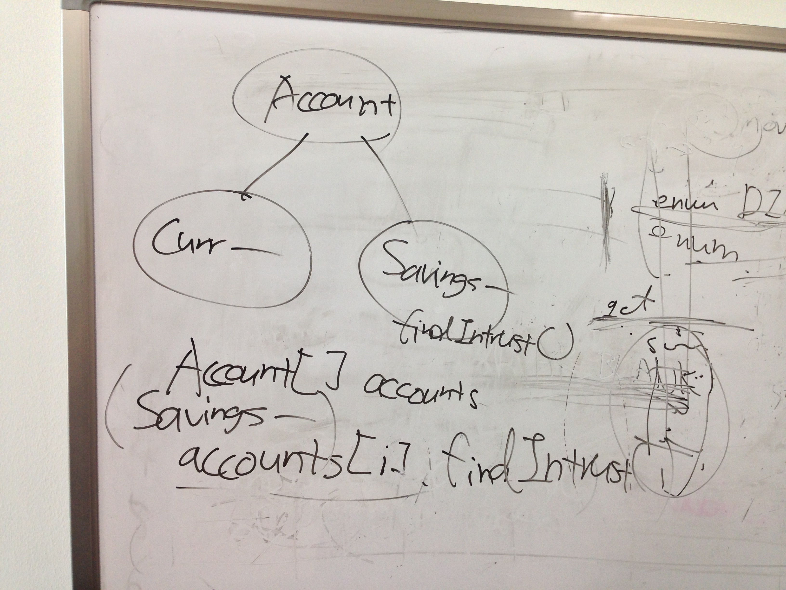
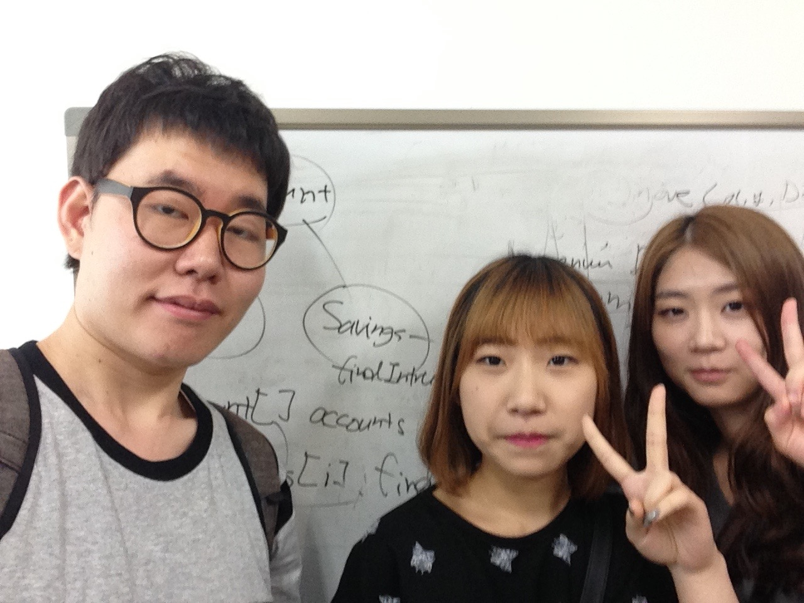
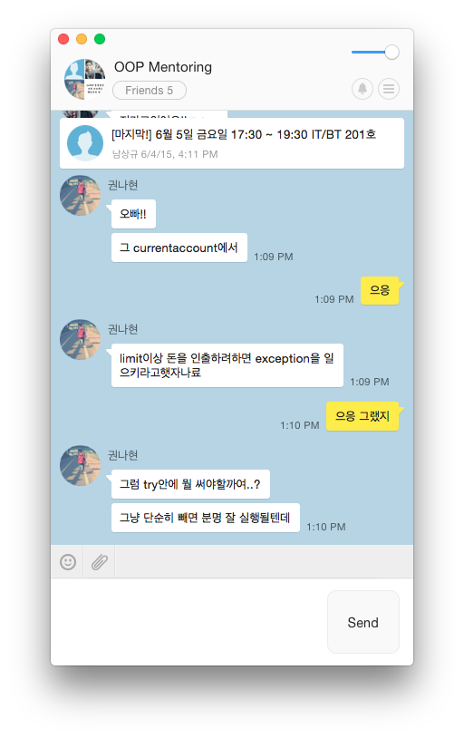
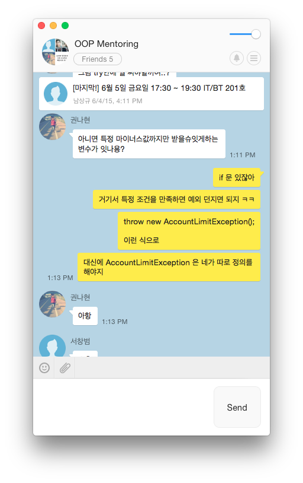

## 멘토링 정보

- 멘토링 교과목명: 객체지향설계및프로그래밍
- 오프라인 멘토링

    * 장소: IT/BT관 504-1호
    * 날짜: 2015년 6월 1일
    * 주당 멘토링 시간: 2시간

- 온라인 멘토링

    * 주소: https://github.com/kyukyukyu/oop-mentoring
    * 날짜: 2015년 4월 30일 ~
    * 주당 멘토링 시간: 상시진행

## 멘토링 진행 결과

- 오프라인: 프로그래밍 과제 수행 코칭
- 온라인: Java에서 예외를 발생시키는 방법에 대하여 설명
- 참석자: 권나현, 서아정 학생 (김도민 학생은 개인 사정으로 인해 불참, 서창범
          학생은 정규 수업으로 인해 불참.)

## 멘토링 내용

이번 오프라인 멘토링 모임에선 지난 시간에 이어 새로 주어진 프로그래밍 과제를
어떻게 진행하면 좋을지에 대해 함께 고민하는 시간을 가졌습니다. 마침 이번 모임에
참여한 친구들이 지난 시간에 불참했던 친구들이어서 지난 시간에 설명했던 내용을
다시 설명하게 되었습니다.

특히 중점을 맞춰 설명한 부분은 프로그래밍 과제의 명세에서 언급된 '계좌 유형을
구분하는 방법'입니다. 이에 관해서 명세에서는 다음과 같이 언급하고 있습니다.

> C. Both type of account should implements interfaces which define the
> specified type of account as constant in the respective interface.

지난 주간 보고서에서도 언급했듯 저는 각 계좌 유형을 표현하는 인터페이스들을
정의하고, 각 인터페이스에는 계좌의 유형을 표현하는 상수를 정의하여, 각 계좌
유형을 표현하는 클래스가 각 인터페이스를 구현하도록 코드를 작성하라는 이야기로
이해했습니다. 상식적으로 생각했을 때 불필요하게 복잡한 설계인 것처럼 보이지만
학습을 목적으로 이런 명세가 제시된 것이라고 생각했습니다.

이 명세 자체는 위에서 언급한 대로 코드를 작성하면 충족할 수 있는데, 문제는 추상
클래스 변수에 들어 있는 인스턴스의 계좌 타입을 구분하는 것이었습니다. 멘티
친구들과 함께 고민하다가 다음과 같은 방법을 찾았습니다. 우선, '계좌'를 표현하는
추상 클래스에 계좌의 유형을 반환하는 `getType()` 메서드를 선언합니다. 그리고,
각 계좌 유형을 나타내는 자식 클래스에서 `getType()` 메서드를 구현할 때,
인터페이스로부터 상속 받은 상수를 반환하도록 하는 것입니다. 일단 이렇게 하면
'계좌'를 표현하는 추상 클래스 타입 변수에 담긴 인스턴스의 계좌 유형을 파악할 수
있게 됩니다. 저는 이에 대한 프로토타입 코드를 작성하여 멘티 친구들에게
보여주었고, 온라인 멘토링 공간에도 업로드하였습니다.

프로그래밍 과제 명세에는 `ClassCastException` 과 같은 예외에 대한 처리를 하라고
언급되어 있었습니다. 오프라인 모임에 참가한 친구들이 이 예외에 대해서
궁금해했습니다. 그래서 저는 어떤 클래스의 인스턴스를 나타내는 식을 다른
클래스로 캐스팅하려고 할 때 캐스팅이 불가능한 경우에 발생하는 런타임 오류라고
설명했습니다. 이것을 설명할 때 프로그래밍 과제의 상황을 예로 들었습니다.
`Account` 클래스 변수가 참조하는 인스턴스가 이 클래스의 자식 클래스인
`CurrentAccount` 클래스의 인스턴스일 때, `Account` 클래스의 또 다른 자식
클래스인 `SavingsAccount`로 이 변수가 사용된 식을 캐스팅하려고 하면 이 예외가
발생한다고 설명했습니다. 그 이유로 `SavingsAccount` 클래스가 `CurrentAccount`
클래스의 서브 클래스가 아닌 점을 들었습니다.

오프라인 모임을 마치고 며칠 뒤에 한 멘티 친구가 코드에서 예외를 직접 발생시키는
방법에 대해 질문을 하였습니다. 계좌에 잔액이 모자른 경우에 예외를 발생시키라는
요구 사항이 과제 명세에 있어서 예외를 직접 발생시킬 필요가 있었다고 합니다.
그래서 `throw` 문의 사용법에 대해 답변해주었습니다.

## 멘토링 증빙

[오프라인 멘토링에서 작성한 프로토타입](https://github.com/kyukyukyu/oop-mentoring/tree/master/8th/snippets)

