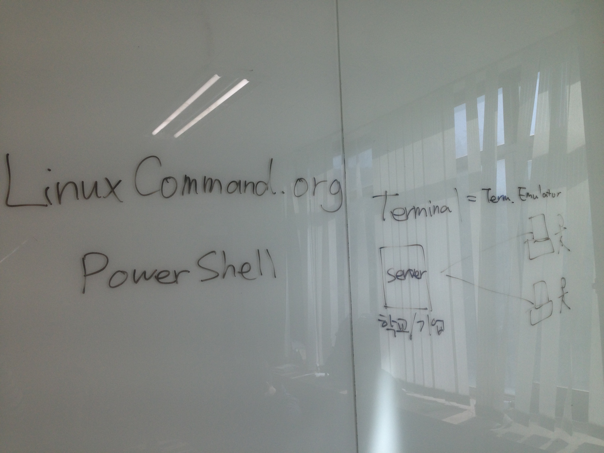
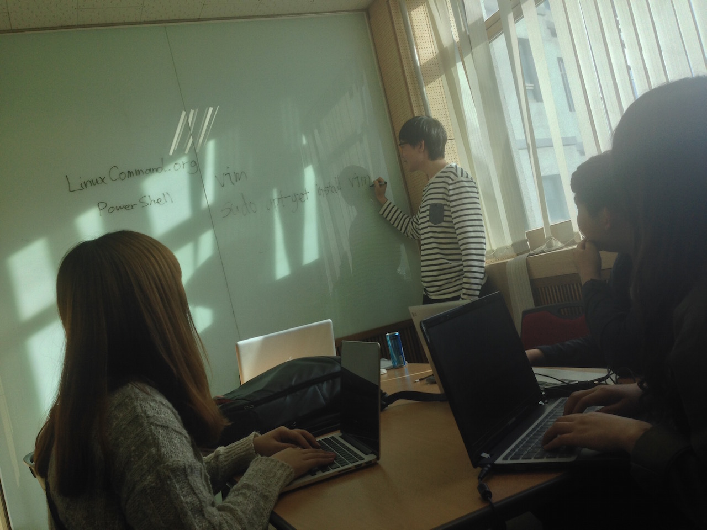

## 멘토링 정보

- 멘토링 교과목명: 객체지향설계및프로그래밍
- 오프라인 멘토링

    * 장소: 산학기술관 519호
    * 날짜: 2015년 5월 4일
    * 주당 멘토링 시간: 2시간

- 온라인 멘토링

    * 주소: https://github.com/kyukyukyu/oop-mentoring
    * 날짜: 2015년 4월 30일 ~
    * 주당 멘토링 시간: 상시진행

## 멘토링 진행 결과

- 오프라인: Linux shell 사용법
- 온라인:
- 참석자: 서창범 학생 제외 전원 참여 (사유: 정규강의 수강)

## 멘토링 내용

이번 오프라인 멘토링 모임에서는 트레이닝 세션만 진행하였습니다. 멘티 친구들이
교과목 혹은 프로그래밍 과제와 관련하여 질문한 것이 없었기 때문입니다. 트레이닝
세션에서는 Linux shell 사용법에 대해서 알아 보았습니다. 트레이닝 세션을
진행하기 위해서 [LinuxCommand.org](http://linuxcommand.org/)에 게시된 내용을
많이 참조하였습니다.

사용법 이전에, Linux shell의 강력함과 그 사용법을 아는 것이 왜 중요한지를
다루었습니다. 먼저, LinuxCommand.org에 소개된 일화를 들어서 설명했습니다. 파일
서버에 설치된 디스크의 용량이 가득 차서 서버가 작동하지 않자, 사용자별 디스크
사용 상황을 파악하여 파일로 출력하는 프로그램을 C++로 작성하느라 오랜 시간을
보냈다면서, Linux shell을 사용하면 명령 한 줄로 끝낼 수 있었을 것이라는
이야기였습니다. 이어서, 일반 사용자를 위한 애플리케이션 소프트웨어와는 달리,
컴퓨터 전공자 및 소프트웨어 엔지니어로서 앞으로 접하게 될 소프트웨어의 대다수가
Unix 기반 플랫폼을 위해 작성된 것이 많을 것이라는 이야기를 하면서 Linux shell의
사용법을 익혀두는 것이 중요하다고 설명했습니다.

이어서 'shell'과 'terminal'이 무엇을 뜻하는지 설명했습니다. LinuxCommand.org에
따르면, 'shell'은 사용자가 키보드를 사용하여 명령을 입력하면 그 명령을 받아
운영체제로 전달하는 프로그램을 뜻하고, 많이 사용되는 shell에는 `bash`, `csh`,
`ksh`, `zsh` 등이 있다고 설명했습니다. 'Terminal'이 무엇인지 설명할 때에는
학교나 기업에 중앙 컴퓨터가 설치되어 있고, 터미널이라는 기계를 사용하여 여기에
접속하여 컴퓨터를 사용하던 역사를 언급하면서, 요즈음 말하는 'terminal'은 이를
흉내내어 GUI 환경에서 shell을 사용할 수 있게 해주는 프로그램이라고 설명했습니다.

그 다음에 본격적으로 Ubuntu Linux를 구동하여 터미널을 실행하고, 쉘을 사용해 보며
사용법을 살펴 보기 시작했습니다. 쉘을 사용할 때 매번 등장하는 프롬프트 문자열의
의미와 Unix 기반 운영체제의 사용자 개념을 함께 설명했습니다. 멘티 친구들이 일반
사용자 대신에 최고 권한 사용자로서 쉘을 사용하는 방법을 궁금해 해서 다음 명령을
입력하고 사용자의 암호를 입력하면 된다고 설명했습니다:

```sh
sudo su
```

한편, 최고 권한이 필요할 때에는 위 명령을 사용하여 최고 권한 사용자로서 쉘을
사용하는 대신에 `su` 명령을 사용하여 일시적으로 최고 권한을 얻어 명령을 실행할
것을 권했습니다.

다음으로, 쉘의 현재 작업 경로를 출력하는 `pwd` 명령을 소개하면서 Windows의 경로
표현법과 Unix 기반 운영체제의 경로 표현법과 파일 시스템의 차이점을 설명했습니다.
Windows에서는 경로를 표현할 때, 디렉토리 이름 사이에 \\ (백슬래시) 를 넣고, Unix
기반 운영체제에서는 / (슬래시) 를 넣는다는 차이점을 먼저 설명했습니다. 그 다음,
Windows에서는 드라이브마다 문자가 할당되어 시스템의 파일 시스템에 여러 개의
root가 존재하고, Unix 기반 운영체제에서는 파일 시스템에 root가 하나만 존재하며,
각 드라이브는 파일 시스템의 특정 디렉토리에 할당되는 차이점을 설명했습니다.

이어서, 현재 작업 경로에 존재하는 디렉토리와 파일들을 나열하는 `ls` 명령과 작업
경로를 변경하는 `cd` 명령에 대해 설명했습니다. 이와 더불어, 경로를 표현하는
방법인 절대 경로와 상대 경로를, Linux 시스템에서의 파일이 지니는 몇 가지 특징에
대해 설명했습니다.

여기까지 설명을 하고 나니 멘티 친구들이 지루해하는 모습이 보였습니다. 구두 설명
위주인 진행에 한계가 보였습니다. 그래서 일단 설명을 멈추고, 다음 오프라인
모임에서는 트레이닝 세션을 다른 방식으로 진행해야겠다고 생각했습니다. 유인물을
미리 작성하고 배포하는 방법 등을 고민해 보고 있습니다.

## 멘토링 증빙




